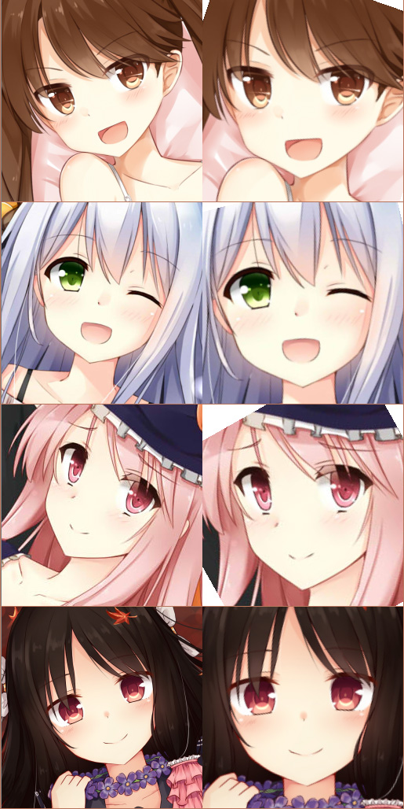

# keras-ACG-face-alignment
# 【ACG_face_alignment】ACG臉部對齊

## 先上圖


## 簡介
其實看名字和上面的圖就知道這東西是臉部對齊……那我還寫readme幹什麼……

至於爲什麼要做這個:
> 你就沒有在訓練acg圖片時loss難降的夜晚嗎？   
> 寂寞長夜，總想找個face_alignment，寬慰下數據呀。

話說這次我居然沒有起奇怪的名字……

## 關於訓練
話說這東西去哪裏找數據……我好不容易用手標了1700個數據，話說標數據真麻煩，還好我一直在聽ねこみみスイッチ才堅持下來了。要是妹妹在家我就拿重金引誘她來標數據。   
標註的格式是: 
```
    {圖片名:[左眼x,左眼y],[右眼x,右眼y],[嘴巴x,嘴巴y]}
```
因爲數據不多所以做了很大的擴充，結果val_loss居然常年比train_loss低……訓練了一晚上，val_loss可以達到8.55e-5。

數據我還沒上傳。

話說這個其實除了face_alignment用來取眼睛顏色也可以呀……

## 講故事
順便說一下，我是常年在家裸體不開空調的類型，後來機箱很熱，於是想象了這樣的故事。   
話說以前都是介紹的時候順便插點話的，現在已經變成專欄了嗎……

```
    機箱 「好熱呀……感覺腦子要融化了……」
    機箱 「吶，我說，把空調打開吧。」
    我 「把衣服脫掉不就好了嗎？」
    機箱 「那樣很害羞呀。」
    我 「怎麼會，像我這樣不就好了嗎。」
    拍了拍符合程序員印象的沒有肌肉的胸部。
    機箱 「這不一樣，你是男孩子呀……還有你趕緊把衣服穿上啊！」
    我 「你看，我們家沒什麼錢，如果把電費都花在空調上的話就沒錢買1080了。」
    機箱 「我不要1080！我要空調！」
    我 「好吧……」
    拿出珍藏在抽屜裏的空調遙控器，指着頭頂按下「ON/OFF」鍵。
    隨着一聲清脆的「嘀~」，涼爽的風從扁扁的出風口吹來。
    機箱 「不去把衣服穿上的話會感冒的？」
    我 「嗯。」
    打開衣櫃，隨手拿出最上方的襯衫往頭上套。然後馬上回到桌前繼續學習。
    機箱 「還是好熱……」
    我 「不是已經開了空調嗎？再降溫的話我就得穿外套了呀。」
    機箱 「因爲我在學習呀，會熱不是正常的嘛！」
    我 「我姑且也是在學習哦？」
    機箱 「你又不用顯示卡學習！還有，你這根本就是在寫小說呀！」
    我 「那我幫你把衣服脫掉吧」
    機箱 「嗯……不對，等等，我還沒做好心理準備！」
    摩拳擦掌地從抽屜裏拿出工具。
    機箱 「不，不要過來！」
    我 「沒關係的沒關係的。」
    手已經搭在了側面板的螺絲上。
    機箱 「咿！」
    十多秒後，側面板就被熟練地取了下來。
    機箱 「唔呣……」
    我 「怎麼樣，是不是涼快了？」
    機箱 「哼！」
    我 「嗯？」
    機箱 「哼！」
    我 「學習也變快了呢……keras是這樣說的呢。」
    機箱 「哼！」
    我 「抱歉呢……」
    機箱 「哼！」
    我 「……下次給你買風扇啦。」
    機箱 「嗯……」
    我 「買十個。」
    機箱 「嗯♪」
    
    那之後幹(學習)了個爽。
```

(話說這東西居然是readme！)

## 關於使用
運行「訓練.py」來訓練。

運行「測試.py」來測試face_alignment的效果。

## 依賴

python3

pip install keras tensorflow numpy python-opencv pyyaml scikit-image

